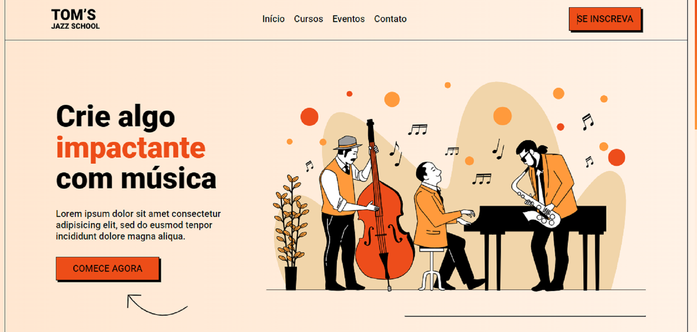

 
    

## 🖥️ Projeto
Esse é um projeto Web Responsivo feito a partir uma ideia de site musical: escola de jazz.

## 🚀 Tecnologias
Esse projeto foi desenvolvido em um evento da OneBitCode com as seguintes tecnologias:

- HTML
- CSS

## 🏷️ Layout 
Você pode visualizar o layout do projeto através 
[desse link](https://www.figma.com/file/76GJ4uK7PyKeAo6dcpVyjA/Tom's-Jazz-School?type=design&node-id=0-1&mode=design).
É necessário ter uma conta no [Figma](https://www.figma.com). 
